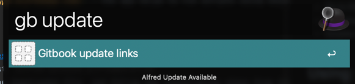
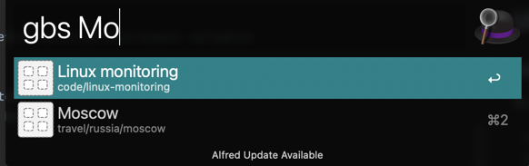

# Alfred Gitbook

The worklow allows you to find articles in documentation/wiki/Personal projects which were using [Gitbook](https://www.gitbook.com/). The current implementation finds all pages are under [SUMMARY.md](https://docs.gitbook.com/integrations/git-sync/content-configuration). 

Inspired by [alfred-my-mind](https://github.com/nikitavoloboev/alfred-my-mind), but wanted to create a tool for everyone, just with configuring site url, repository and branch name.

## Requirements

* [Alfred](https://www.alfredapp.com/) – the app helps to run scripts using keyboard shortcuts or keywords
* JDK 8
* You need to prepare the next things
  * a Site URL which was build by Gitbook
  * a GIT repository URL which is connected with your site
  * a GIT repository branch

## Installation

* Go to the [releases page](https://github.com/dmmax/alfred-gitbook/releases)
* Download the latest `alfred-gitbook.alfredworkflow`
* Double-click on the downloaded file, and follow the installation steps from the Alfred app

## Using

### Configuration

To configure the workflow, you need to define workflow environment variables

* `gb_url` – the Site URL
* `git_book_repository` – the GIT repository URL
* `git_book_branch` – the GIT repository branch

For example

### Update links

When configuration is done, you need to update your links, for that need to call `gb update` in Alfred

The update mechanism will take some time to read the SUMMARY.md depends on the content of your repository

### Find links

Now, you're ready to open links from your site. For that, you need to call `gbs <name>` in Alfred

### How-to use

